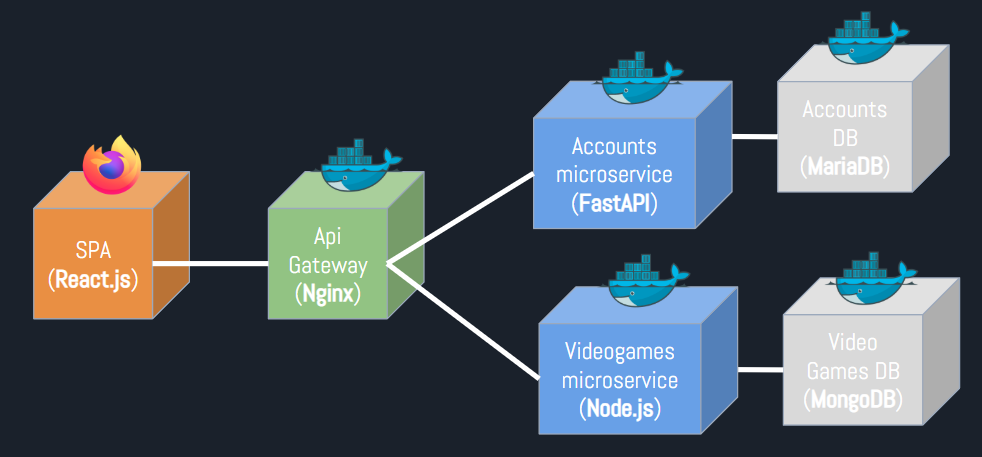
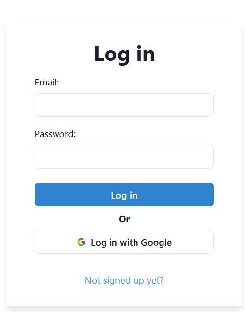
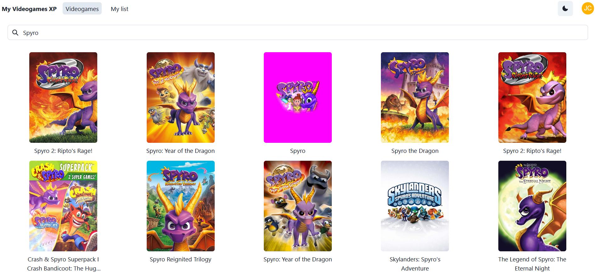
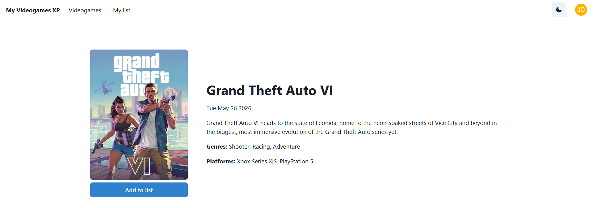
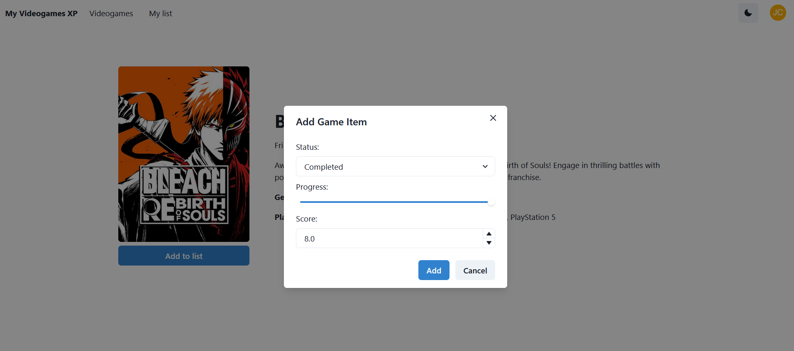

# MyVideogamesXP

**MyVideogamesXP** is a web application that allows users to track their
games progress easily, as well as providing data about a wide variety
of titles by means of [IGDB API](https://www.igdb.com/api) owned by Twitch.

## Built With

 


## Architecture




## Features

- 🔐 Log in using Google or user/email combination.
  


- 🔍 Search a huge catalog of games via IGDB.
  



- 📖 View game details to learn more about them.
  


- ⭐ Add your favorite games and begin tracking your progress.



- 🛠️ Manage your list comfortably editing and removing game entries.
  


## Getting Started

Follow these steps to set up the application locally.

### Prerequisites
- Docker
- Docker Compose

### Configuring Environment Variables

Before running the application, ensure you’ve created and properly configured the required `.env`. The repository includes sample `.env` files to guide you inside the following folders:
- [frontend](./frontend/)
- [users-backend](./users-backend/)
- [videogames-backend](./videogames-backend/)

Some essential credentials you’ll need:

- **Google OAuth Credentials** – Used for user authentication. Follow the [Google Developer Guide](https://developers.google.com/workspace/guides/create-credentials) to set them up.
- **IGDB API Credentials (via Twitch OAuth)** – Required for accessing the game catalog. See the [IGDB API documentation](https://api-docs.igdb.com/#about) for details.


### Running with Docker (Dev)

To get everything up and running (including the frontend), use:

```bash
docker compose --profile frontend up -d
```


## API Endpoints

### 🧑 User Accounts – `/api/accounts`

| Endpoint                  | Method | Description                     |
| ------------------------- | ------ | ------------------------------- |
| `/register`               | POST   | Register a new user.            |
| `/auth/login`             | POST   | Log into an existing account.   |
| `/auth/logout`            | POST   | Log out.                        |
| `/users/me`               | GET    | Get authenticated user's data.  |
| `/oauth/google/authorize` | GET    | Authorize with Google OAuth.    |
| `/oauth/google/callback`  | GET    | Google authentication callback. |


### 🎮 Video Games – `/api/videogames`

| Endpoint         | Method | Description                              |
| ---------------- | ------ | ---------------------------------------- |
| `/igdb/<id>`     | GET    | Get game details by ID.                  |
| `/igdb/search`   | GET    | Search for games.                        |
| `/my-games`      | GET    | Get yor games list.                      |
| `/my-games`      | POST   | Add a game to your list.                 |
| `/my-games/<id>` | PUT    | Update tracking data of a specific game. |
| `/my-games/<id>` | DELETE | Delete a game from your list.            |


